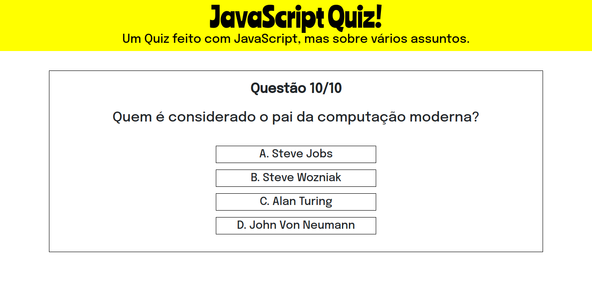
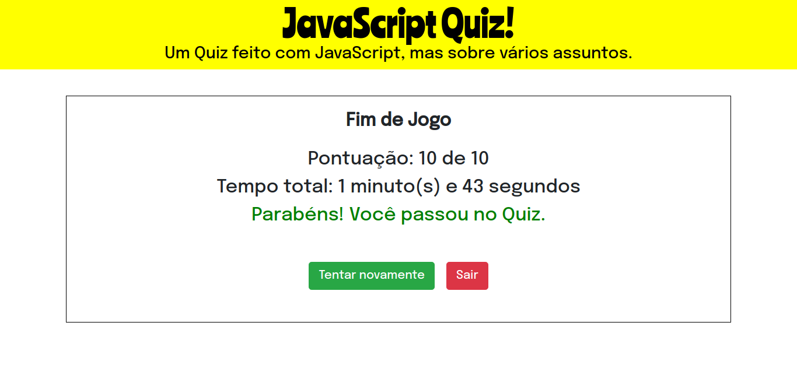

	

> Status do Projeto: Concluído :heavy_check_mark:

<h2>Geral</h2>

	O principal objetivo para o desenvolvimento dessa aplicação não é resolver algum problema específico ou geral, mas única e simplesmente colocar em prática os conhecimentos adquiridos em HTML, CSS e JavaScript, sendo esse último o maior foco da prática. Sobre o projeto em si, como a imagem acima sugere, se trata de um <strong>Quiz</strong> desenvolvido com <strong>JavaScript</strong>. Toda a dinâmica é criada com <em>Arrays</em>. Nesse projeto arrays são usados para "salvar" as perguntas, respostas corretas e respostas do jogador, embora não seja a melhor das alternativas, atende aos objetivos e requisitos do projeto, ser simples e pouco complexo.

	
	Exemplo de pergunta do Quiz

<h2>O Jogo</h2>

	Com 3 temas diferentes: <em>Tecnologia, Futebol e Geral</em>. Na tela inicial o jogador seleciona o tema que deseja jogar e a partir disso ele terá que responder 10 perguntas sobre o assunto escolhido. Após responder as 10 perguntas, estatísticas do jogo são exibidas, sendo elas: A quantidade de respostas corretas, quanto tempo o jogador levou para responder todas as perguntas e se ele <strong>passou</strong> ou <strong>falhou</strong> no Quiz.

	
	Tela de Fim de Jogo

## Para Jogar
- Se quiser apenas testar o jogo, basta acessar o link abaixo:
	- <a href="https://quiz.phdfreitas.repl.co/">JavaScript Quiz!</a>
- Se quiser baixar o jogo e fazer seus próprios testes e alterações:
	- No terminal do seu sistema operacional, cole o seguinte comando:
	> git clone https://github.com/phdfreitas/Quiz.git