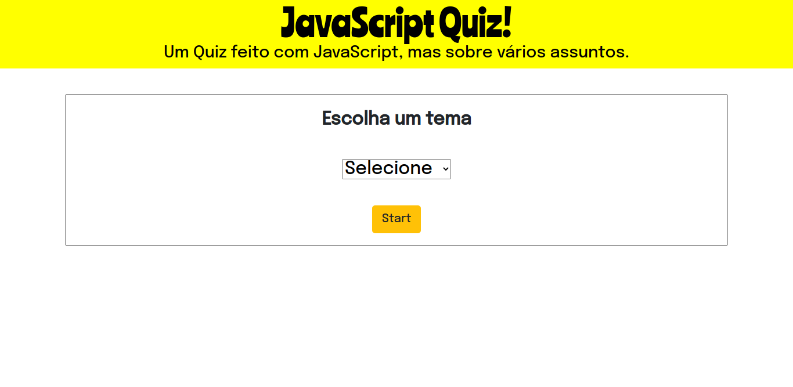

	

> Status do Projeto: Em Desenvolvimento :warning:

## Geral
O objetivo primordial para o desenvolvimento dessa aplicação não é resolver algum problema específico ou geral, mas única e simplesmente colocar em prática os conhecimentos adquiridos em HTML, CSS e JavaScript, sendo esse último o maior foco da prática. Sobre o projeto em si, como a imagem acima sugere, se trata de um **Quiz** desenvolvido com **JavaScript**. Toda a dinâmica é criada com *Arrays*. Arrays nesse projeto são usados para "salvar" as perguntas, respostas corretas e respostas do jogador, não sendo a melhor das alternativas, mas que atende aos objetivos e requisitos do projeto, ser simples e pouco complexo.

	
	Exemplo de pergunta do Quiz

## O Jogo
Composto de 3 temas diferentes, sendo eles: *Tecnologia, Futebol* e *Geral.* Na tela inicial o jogador seleciona o tema que deseja jogar e a partir disso ele terá que responder 10 perguntas sobre o assunto. O nível das perguntas pode variar entre fácil e não tão fácil, isso certamente varia de jogador para jogador. Ao final do jogo, após responder todas as 10 perguntas, as estátisticas são exibidas, sendo elas: _A quantidade de respostas corretas, quanto tempo o jogador levou para responder todas as perguntas e se ele **passou** ou **falhou** no Quiz._

	
	Tela de Fim de Jogo

## Para Jogar
- Se quiser apenas testar o jogo, basta acessar o link abaixo:
	- <a href="">JavaScript Quiz!</a> (Ainda não disponível)
- Se quiser baixar o jogo e fazer seus próprios testes e alterações:
	- No terminal do seu sistema operacional, cole o seguinte comando:
	> git clone https://github.com/phdfreitas/Quiz.git